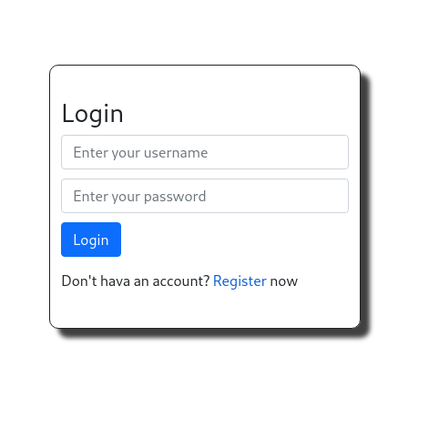
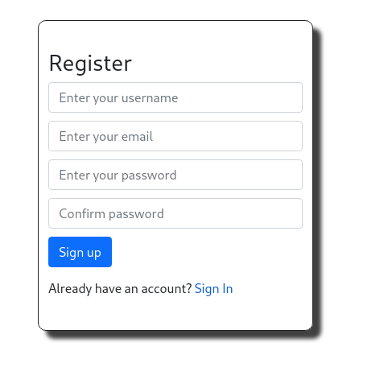
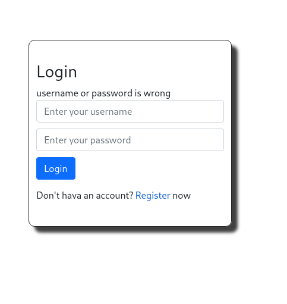
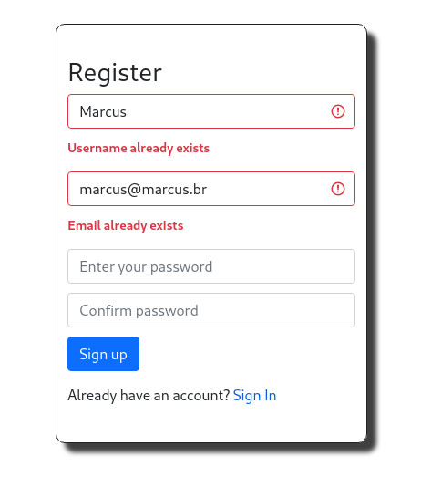
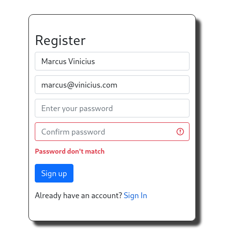
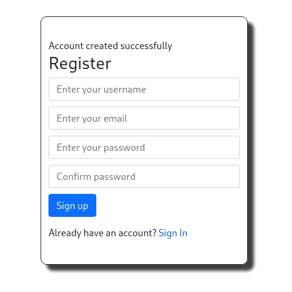

<p align="center">
  
</p>
<h1 align='center'>🚧 Django Login System 🚧 </h1>
A login system built in Django, where we can create a user and login in to the system.
This is a independent app, which we can used in any application that required a login system
The system shows notifications in cases:
<ul>
  <li>When a user is created</li>
  <li>When the username or password is incorrect</li>
  <li>When a user tries to register an already registered username or email.</li>
  <li>When passwords do not match</li>
</ul>
<h2>Layout</h2>
  
  
  
  
  
  
  
<h2>How to run this repo: 🚀</h2>

```bash

# Clone this repo
$ git clone git@github.com:SMarkus27/Login_System.git

# Open the project folder in the terminal/cmd
$ cd Login_System

# Open the ToDo folder
$ cd login

# Run the command to create a virtualenv:
$ python -m pip venv login

# Activate the venv:
$ source login/bin/activate

# Install all dependencies in the requeriments.txt file.
$ pip install -r requeriments.txt

# Run the command to activate the application:
$ python manage.py runserver

# The server starts at the port:8000 - go to http://127.0.0.1:8000 

```

<h2>Tech Stack:</h2>
<ul>
  <li>HTML5</li>
  <li>CSS3</li>
  <li>Django/Python</li>
  <li>SQLite</li>
  <li>Crispy Forms</li>
  
</ul>
 📝 License

This project is under license [MIT](./LICENSE).

Made by Marcus Vinicius 👋🏽 [Get in touch!](https://www.linkedin.com/in/marcus-vinicius-campos=pereira)
